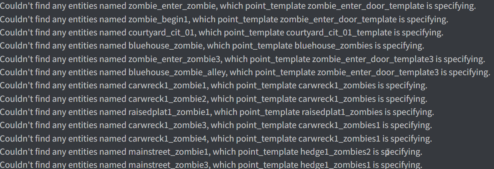

# SM-NMRiH-consolespam_filter
This is a sourcemod plugin for No More Room in Hell which filters out specific engine console errors. 

Are you a server admin? Are you getting spammed with this kinda console errors?:

Perhaps you could use this.

Why?:
 - Many custom NMRiH custom, as well as official, maps have broken hammer io references, incorrect or missing modelnames, incorrectly configured entities etc. These spit out console errors, some of which are so common and spammy they are best filtered out of server console.
 - One example of such spam is: Entity entid (class <zombieclass>) reported ENTITY_CHANGE_NONE but <entprop> changed. 
 - To save my sanity due to the above mentioned console spam.

How to use:
1. If not done already: install sourcemod.
2. Move gamedata and plugins folder to your ~/sourcemod folder.
3. If you so desire, add additional message filtering in the /gamedata/nmrih_console_spam.txt file: Find the signature for the error message by reversing or do an educated guess, and add them to a new SpamPatch_Sig* signature entry. Reference this signature entry in addresses too.
